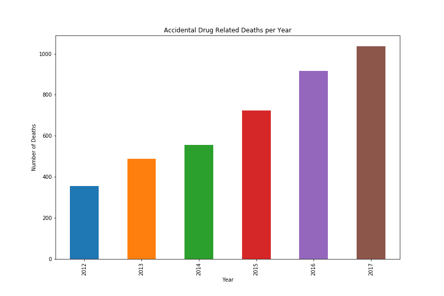
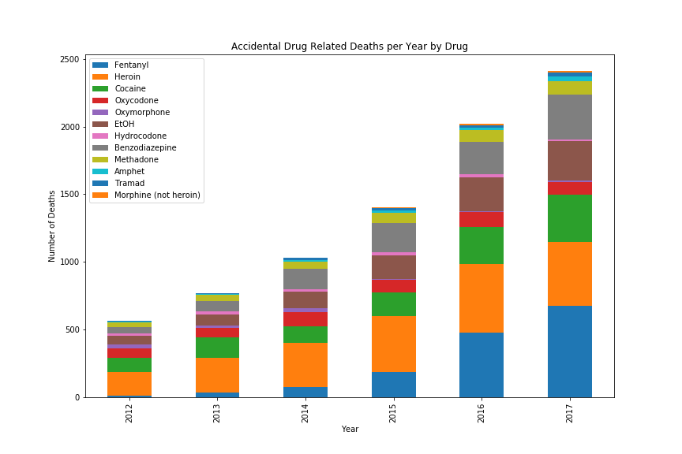

# **DataViz-Project1: Drug Mortality and Socio-Economic Conditions in Connecticut**     


### Project Proposal      
We are looking to analyze trends in drug overdose death rates in Connecticut and suggest improvements in data collection. And the research of the project aims to answer the following questions:    


**Is there a relationship between**  

* drug-induced mortality rates and income?   
* drug-induced mortality rates and age?    
* drug-induced mortality rates and education?    
* drug-induced mortality rates and gender?    
* drug-induced mortality rates and geo-location (counties)?    
* drug-induced mortality rates and unemployment rates?    
* drug-induced mortality rates and barriers to medical treatment?       


### Data Sources     

* [*Accidental Drug Overdose Related Deaths in Connecticut 2012-2017.csv*](https://catalog.data.gov/dataset/accidental-drug-related-deaths-january-2012-sept-2015).  (source:[Data.gov](https://catalog.data.gov/dataset))      
* *2016 Education Attainment Connecticut.csv* (source: [census.gov](https://www.census.gov/quickfacts/CT))     
* *2016 Employment Status by Age.csv*  (source: [census.gov](https://www.census.gov/quickfacts/CT))    
* *2016 Median Household Income County.csv* (source: [census.gov](https://www.census.gov/quickfacts/CT))   
* *FairfieldCountyPopulation.csv* (source: [census.gov](https://www.census.gov/quickfacts/CT))  
* *HartfordCountyPopulation.csv* (source: [census.gov](https://www.census.gov/quickfacts/CT))  
* *LitchfieldCountyPopulation.csv* (source: [census.gov](https://www.census.gov/quickfacts/CT))  
* *MiddlesexCountyPopulation.csv*  (source: [census.gov](https://www.census.gov/quickfacts/CT))  
* *NewHavenCountyPopulation.csv*  (source: [census.gov](https://www.census.gov/quickfacts/CT))  
* *NewLondonCountyPopulation.csv* (source: [census.gov](https://www.census.gov/quickfacts/CT))   
* *TollandCountyPopulation.csv* (source: [census.gov](https://www.census.gov/quickfacts/CT))  
* *WindhamCountyPopulation.csv* (source: [census.gov](https://www.census.gov/quickfacts/CT))  
* *PopByCountyByYear.csv*  (source: [factfinder.census.gov](https://factfinder.census.gov/faces/nav/jsf/pages/index.xhtml))  
* *tl_2010_09_county10.json*  (source: [factfinder.census.gov](https://factfinder.census.gov/faces/nav/jsf/pages/index.xhtml))   
* *Unemployment Rate by County.csv* (source: [BLS Public Data API](https://censusreporter.org/profiles/35000US72850-danbury-ct-metropolitan-necta/))     


### Data Cleanup &amp; Analysis

*Accidental Drug Overdose Related Deaths in Connecticut 2012-2017.csv* is the raw dataset this project uses for the research. This dataset was retrieved from [catalog.data.gov](https://catalog.data.gov/dataset/accidental-drug-related-deaths-january-2012-sept-2015). With this dataset in hand, the first thing is to import the data into a dataframe and explore it.   

#### Columns
The dataset has 36 columns including the information about the dead such as *Sex*, *Age*, *Residence City* and the information related to the death such as *Death City*, *Death County*, *InjuryPlace*, *DescriptionofInjury*. In addition, the drug types that are causing the death are included in the dataset.   
```python
# Import the raw data
drug_death_raw_df = pd.read_csv("../Resources/Accidental_Drug_Related_Deaths_2012-2017.csv")
drug_death_raw_df = drug_death_raw_df[1:]
drug_death_raw_df.columns
```


    Index(['CaseNumber', 'Date', 'Year', 'Sex', 'Race', 'Age', 'Residence City',
           'Residence State', 'Residence County', 'Death City', 'Death State',
           'Death County', 'Location', 'DescriptionofInjury', 'InjuryPlace',
           'ImmediateCauseA', 'Heroin', 'Cocaine', 'Fentanyl', 'Oxycodone',
           'Oxymorphone', 'EtOH', 'Hydrocodone', 'Benzodiazepine', 'Methadone',
           'Amphet', 'Tramad', 'Morphine (not heroin)', 'Other', 'Any Opioid',
           'MannerofDeath', 'AmendedMannerofDeath', 'DeathLoc',
           'DeathLocationCity', 'DeathLocLat', 'DeathLocLong'],
          dtype='object')  
		  
#### Missing Values  
There are 4082 drug overdose related deaths in the dataset. However, the output of *drug_death_raw_df.count()* clearly shows that not each column has 4082 rows. For example, the column *Age* has 4080 values and 2 values are missing.
Take the column *Death County* for example, it has 3430 value counts which are much less than the total death cases. But since both *DeathLocLat* and *DeathLocLong* have 4082 values, we can utilize the google api along with the latitude and longitude to retrieve the death county. The column such as *Death State* is missing almost 50 percent of 
values. But we can confidently fill the empty values with `CT` as the dataset was collected in Connecticut. Besides, we realized that even though some columns are missing values, it does not mean the data is not good. For example, if a drug overdose related death is caused by Heroin and Cocaine, then other drug columns would be empty.   
```python
# Import the raw data
drug_death_raw_df = pd.read_csv("../Resources/Accidental_Drug_Related_Deaths_2012-2017.csv")
drug_death_raw_df = drug_death_raw_df[1:]
drug_death_raw_df.count()
```


    CaseNumber               4082
    Date                     4080
    Year                     4082
    Sex                      4079
    Race                     4072
    Age                      4080
    Residence City           3948
    Residence State          2116
    Residence County         3332
    Death City               4079
    Death State              2201
    Death County             3430
    Location                 4061
    DescriptionofInjury      1495
    InjuryPlace              4004
    ImmediateCauseA          4082
    Heroin                   2154
    Cocaine                  1176
    Fentanyl                 1466
    Oxycodone                 547
    Oxymorphone                97
    EtOH                     1005
    Hydrocodone               105
    Benzodiazepine           1077
    Methadone                 388
    Amphet                    103
    Tramad                     90
    Morphine (not heroin)      56
    Other                     378
    Any Opioid                714
    MannerofDeath            4075
    AmendedMannerofDeath       28
    DeathLoc                 4082
    DeathLocationCity        4082
    DeathLocLat              4082
    DeathLocLong             4082
    dtype: int64    
	

#### Additional Data  
The dataset itself has the limitation when it comes to the questions we want to answer. It cannot give us any insight into the relationship between the drug-induced mortality rates and income, neither can it tell us if the unemployment is the main reason causing drug-induced deaths. To be able to answer these kind of questions, we have to find 
additional data. That is why we have different data sources in the previous section.  

`For example, below is the snippet of getting the unemployment rate in 8 counties in Connecticut.`  
### Using BLS API to retrieve the data for 8 counties in Connecticut


```python

headers = {'Content-type': 'application/json'}
start_year, end_year = '2012', '2017'
index = 0
for county, sids in county_to_series_id.items():
    print(county)
#     print(sids)
    data = json.dumps({"seriesid": sids,"startyear":start_year, "endyear":end_year})

    p = requests.post('https://api.bls.gov/publicAPI/v2/timeseries/data/', data=data, headers=headers)

    json_data = json.loads(p.text)
    
    for series in json_data['Results']['series']:
        x=prettytable.PrettyTable(["series id","year","period","value","footnotes"])
        seriesId = series['seriesID']

        for item in series['data']:
            year = item['year']
            period = item['period']
            value = item['value']
            footnotes=""
            for footnote in item['footnotes']:
                if footnote:
                    footnotes = footnotes + footnote['text'] + ','
            
            if '.' in value:
                unemployment_df.loc[index, 'County'] = county
                unemployment_df.loc[index, 'Year'] = year
                unemployment_df.loc[index, 'Period'] = periods.get(period)
                unemployment_df.loc[index, 'Unemployment Rate'] = value
                unemployment_df.loc[index, 'Footnote'] = footnotes[0:-1]
            index +=1
```

    Fairfield
    Litchfield
    New Haven
    Middlesex
    Hartford
    Tolland
    New London
    Windham
    


```python
# Visualize the dataframe
unemployment_df.head()
```


<div>

<table border="1" class="dataframe">
  <thead>
    <tr style="text-align: right;">
      <th></th>
      <th>County</th>
      <th>Year</th>
      <th>Period</th>
      <th>Unemployment Rate</th>
      <th>Footnote</th>
    </tr>
  </thead>
  <tbody>
    <tr>
      <th>0</th>
      <td>Fairfield</td>
      <td>2017</td>
      <td>Dec</td>
      <td>3.9</td>
      <td>Data were subject to revision on April 20, 2018.</td>
    </tr>
    <tr>
      <th>1</th>
      <td>Fairfield</td>
      <td>2017</td>
      <td>Nov</td>
      <td>4.1</td>
      <td>Data were subject to revision on April 20, 2018.</td>
    </tr>
    <tr>
      <th>2</th>
      <td>Fairfield</td>
      <td>2017</td>
      <td>Oct</td>
      <td>4.2</td>
      <td>Data were subject to revision on April 20, 2018.</td>
    </tr>
    <tr>
      <th>3</th>
      <td>Fairfield</td>
      <td>2017</td>
      <td>Sept</td>
      <td>4.2</td>
      <td>Data were subject to revision on April 20, 2018.</td>
    </tr>
    <tr>
      <th>4</th>
      <td>Fairfield</td>
      <td>2017</td>
      <td>Aug</td>
      <td>4.6</td>
      <td>Data were subject to revision on April 20, 2018.</td>
    </tr>
  </tbody>
</table>
</div>   

	
#### Data Analysis  
The final report *Drug Mortality and Socio-Economic conditions in Connecticut.pptx* is attached to the repository.   

Year over year, we observed an increasing trend of the drug-induced deaths in CT.  

```python
# Import data and clean up dataframe
death_data_df = pd.read_csv('Resources/Accidental_Drug_Related_Deaths_2012-2017_cleaned.csv')
death_data_df = death_data_df.dropna(subset=["Age"])
death_data_df.fillna(0, inplace=True)
mapping = {'Y': 1, 'y': 1}
death_data_df = death_data_df.replace({'Heroin': mapping, 'Cocaine': mapping, 'Fentanyl': mapping, 'Oxycodone': mapping,
       'Oxymorphone': mapping, 'EtOH': mapping, 'Hydrocodone': mapping, 'Benzodiazepine': mapping, 'Methadone': mapping,
       'Amphet': mapping, 'Tramad': mapping, 'Morphine (not heroin)': mapping, 'Other': mapping, 'Any Opioid': mapping})
death_data_df = death_data_df[death_data_df.Year >= 2012]
death_data_df[['Heroin', 'Cocaine', 'Fentanyl', 'Oxycodone','Oxymorphone', 'EtOH', 'Hydrocodone', 'Benzodiazepine', \
               'Methadone', 'Amphet', 'Tramad', 'Morphine (not heroin)']]=death_data_df[['Heroin', 'Cocaine', 'Fentanyl', \
                'Oxycodone', 'Oxymorphone', 'EtOH', 'Hydrocodone', 'Benzodiazepine', 'Methadone', 'Amphet', 'Tramad', \
                'Morphine (not heroin)']].apply(pd.to_numeric, errors='coerce')
```


```python
# Graph deaths by year
by_year = death_data_df.groupby(['Year'])
by_year = by_year['CaseNumber'].count()
by_year.plot(kind='bar', figsize=(12,8))
plt.title("Accidental Drug Related Deaths per Year")
plt.ylabel("Number of Deaths")
plt.savefig("DeathsPerYear.png")
plt.show()
```

  


Regarding to the accidental drug-induced deaths year over year, we observed *Fentanyl* is the main contributor and the deaths caused by
*fentanyl* kept increasing in the past 5 years.  
```python
# Deaths by drug
deaths_by_drug = death_data_df.groupby('Year').agg({'Fentanyl': sum, 'Heroin':sum, 'Cocaine':sum, 'Oxycodone': sum, \
                                                    'Oxymorphone': sum, 'EtOH': sum, 'Hydrocodone': sum, 'Benzodiazepine': sum, \
                                                    'Methadone': sum, 'Amphet': sum, 'Tramad': sum, 'Morphine (not heroin)': sum})
deaths_by_drug.plot(kind='bar', figsize=(12,8), stacked=True)
plt.title("Accidental Drug Related Deaths per Year by Drug")
plt.ylabel("Number of Deaths")
plt.savefig("Output/DeathsByDrug.png")
plt.show()
```





### Presentation

After you've analyzed your data to your satisfaction, you'll put together a presentation to show off your work, explain your process, and discuss your conclusions.

This presentation will be delivered as a slideshow, and should give your classmates and instructional staff an overview of your work. PowerPoint, Keynote, and Google Slides are all acceptable for building slides.

As long as your slides meet the [presentation requirements](PresentationRequirements.md), you are free to structure the presentation however you wish, but students are often successful with the format laid out in the [presentation guidelines](PresentationGuidelines.md).


## Technical Requirements
**The technical requirements for Project 1 are as follows.**

- [ ] Use Pandas to clean and format your data set(s)

- [ ] Create a Jupyter Notebook describing the **data exploration and cleanup** process

- [ ] Create a Jupyter Notebook illustrating the **final data analysis**

- [ ] Use Matplotlib to create a total of **6-8 visualizations** of your data (ideally, at least 2 per "question" you ask of your data)

- [ ] Save PNG images of your visualizations to distribute to the class and instructional team, and for inclusion in your presentation

- [ ] Optionally, use at least one API, if you can find an API with data pertinent to your primary research questions

- [ ] Create a write-up summarizing your major findings. This should include a heading for each "question" you asked of your data, and under each heading, a short description of what you found and any relevant plots.

## Presentation Requirements
**The presentation requirements for Project 1 are as follows.**

Your presentation must:

- [ ] Be at least 8-10 min. long

- [ ] Describe the core message or hypothesis for your project.

- [ ] Describe the questions you and your group found interesting, and what motivated you to answer them

- [ ] Summarize where and how you found the data you used to answer these questions

- [ ] Describe the data exploration and cleanup process (accompanied by your Jupyter Notebook)

- [ ] Describe the analysis process (accompanied by your Jupyter Notebook)

- [ ] Summarize your conclusions. This should include a numerical summary (i.e., what data did your analysis yield), as well as visualizations of that summary (plots of the final analysis data)

- [ ] Discuss the implications of your findings. This is where you get to have an open-ended discussion about what your findings "mean".

- [ ] Tell a good story! Storytelling through data analysis is no different than in literature. Find your narrative and use your analysis and visualization skills to highlight conflict and resolution in your data.


## Presentation Guidelines
**You are free to structure your presentations to your liking, but students tend to have succes with the following format.**

* Title Slide
  * Include the name of the Project and Group Members

* Motivation &amp; Summary Slide
  * Define the core message or hypothesis of your project.
  * Describe the questions you asked, and _why_ you asked them
  * Describe whether you were able to answer these questions to your satisfication, and briefly summarize your findings

* Questions &amp; Data
  * Elaborate on the questions you asked, describing what kinds of data you needed to answer them, and where you found it

* Data Cleanup &amp; Exploration
  * Describe the exploration and cleanup process
  * Discuss insights you had while exploring the data that you didn't anticipate
  * Discuss any problems that arose after exploring the data, and how you resolved them
  * Present and discuss interesting figures developed during exploration, ideally with the help of Jupyter Notebook

* Data Analysis
  * Discuss the steps you took to analyze the data and answer each question you asked in your proposal
  * Present and discuss interesting figures developed during analysis, ideally with the help of Jupyter Notebook

* Discussion
  * Discuss your findings. Did you find what you expected to find? If not, why not? What inferences or general conclusions can you draw from your analysis?

* Post Mortem
  * Discuss any difficulties that arose, and how you dealt with them
  * Discuss any additional questions that came up, but which you didn't have time to answer: What would you research next, if you had two more weeks?

* Questions
  * Open-floor Q&amp;A with the audience


- - -

#### Copyright

Coding Boot Camp &copy; 2018. All Rights Reserved.

